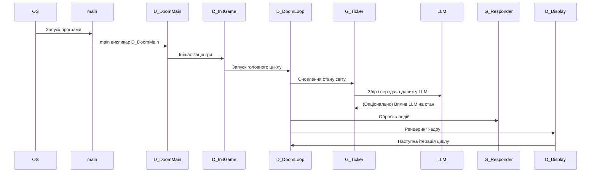
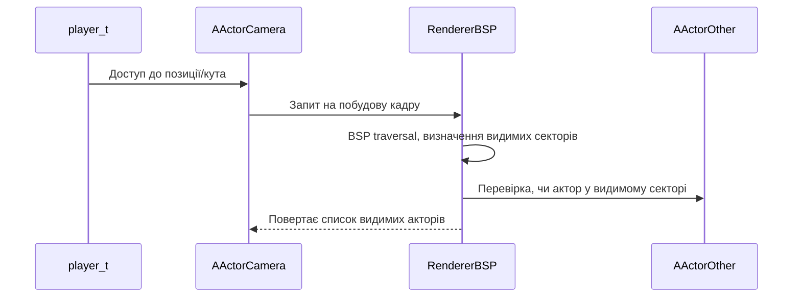
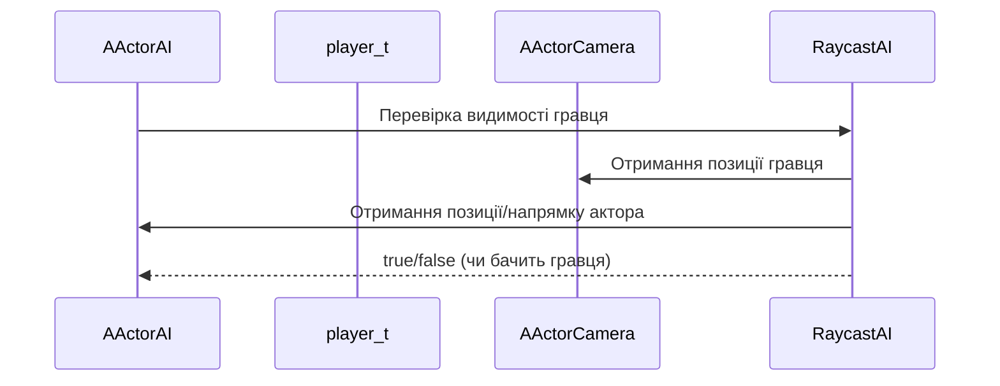
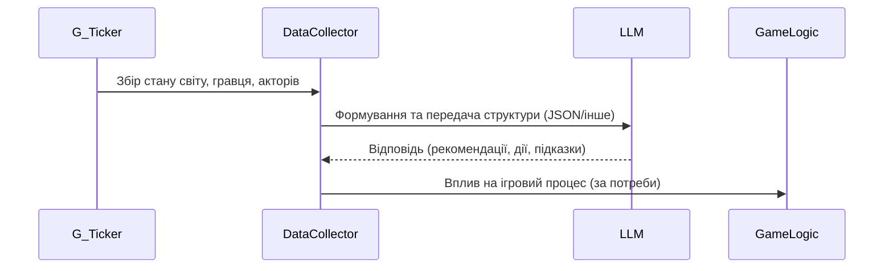

# Діаграми викликів основних підсистем GZDoom (з урахуванням LLM)

## 1. Високорівнева діаграма викликів життєвого циклу

**Опис:**
- ОС або лаунчер запускає програму, яка входить у main.
- main викликає D_DoomMain, що ініціалізує гру через D_InitGame.
- D_DoomLoop запускає нескінченний цикл, у якому послідовно викликаються G_Ticker (логіка), інтеграція з LLM, G_Responder (input), D_Display (рендер).
- LLM може впливати на стан гри (наприклад, змінювати поведінку AI).

---

## 2. Діаграма викликів для визначення видимості гравця та акторів

**Опис:**
- Гравець має посилання на свою "камеру" (AActor).
- Камера передає свою позицію та кут огляду рендереру.
- Рендерер проходить BSP-дерево, визначає видимі області та акторів.
- Список видимих акторів можна використати для інтеграції з LLM.

---

## 3. Діаграма викликів для визначення, хто бачить гравця

**Опис:**
- Для кожного актора (наприклад, монстра) AI або логіка виконує трасування променя до позиції гравця.
- Якщо немає перешкод і гравець у полі зору — актор "бачить" гравця.
- Цю інформацію можна зібрати для LLM або для поведінки AI.

---

## 4. Діаграма інтеграції з LLM у циклі гри

**Опис:**
- Після оновлення стану світу Collector формує структуру для LLM.
- LLM повертає відповідь, яка може впливати на гру (наприклад, змінити поведінку AI, дати підказку гравцю).

---

Документ містить основні діаграми викликів для розуміння архітектури GZDoom та точок інтеграції з LLM. Для деталізації окремих підсистем або додаткових діаграм — звертайтесь!
